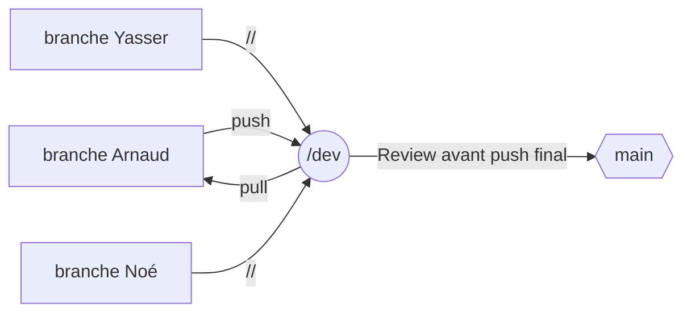

<h1> EXAMEN JAVASCRIPT B1 Info </h1>
=======

# Les objectifs :
Créer un site web qui regroupe les données de tous les super héros connus à ce jour.  
Il faudra inclure une barre de recherche ainsi que plusieurs pages web et utiliser une api en json fournie.  
Le projet doit être rendu sur un repository github.  

# L'organisation :

Pour notre groupe nous avons choisi les outils suivants: 
    Outil git: GitHub Desktop  
    Miro White board et Kanban pour les tâches  
    IDE: Visual Studio Code  

# Organigram github :

   
