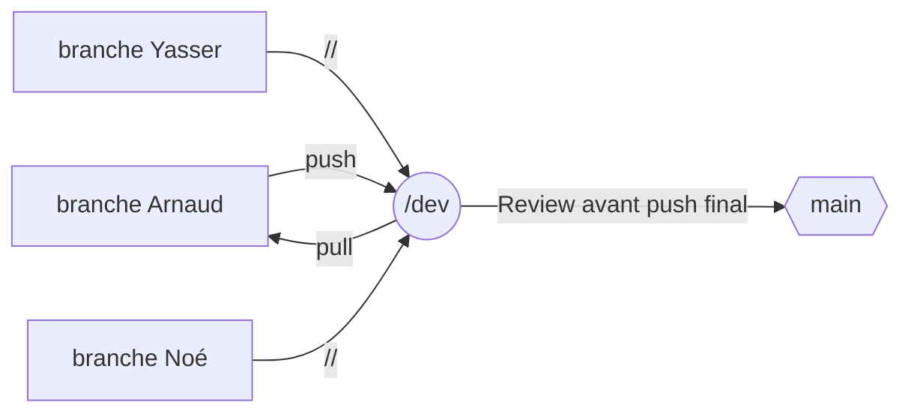

# EXAMEN JAVASCRIPT B1 Info
=======
# Projet-JS

# Les objectifs :
Créer un site web qui regroupe les données de tous les super héros connus à ce jour.
Il faudra inclure une barre de recherche ainsi que plusieurs pages web et utiliser une api en json fournie.
Le projet sera rendu sur github

# L'organisation :

Pour notre groupe nous avons choisi les outils suivants:
    Outil git: GitHub Desktop
    White board et Kanban pour les tâches: Miro 
    IDE: Visual Studio Code 

# Organigram github

  
